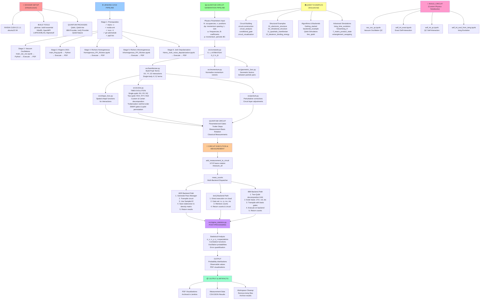

# QCNO Repository Architecture Flowchart

## Architecture Overview

This flowchart shows the complete QCNO infrastructure organized in 8 major sections:

### 1. **Docker Setup (Red)** 🐳
- NVIDIA CUDA 12.1.1 with Ubuntu 22.04
- Build tools (gfortran, OpenMPI, LAPACK, libhdf5)
- Quantum computing packages (Qiskit, IBM Provider, IonQ Provider)

### 2. **Jenkins CI/CD Pipeline (Blue)** ⚙️
- Prerequisites validation (compilers, GPU, dependencies)
- 5 physics simulation stages:
  - Vacuum oscillations
  - Rogerro 2021 full Hamiltonian
  - Richers 2021 homogeneous MF
  - Richers 2021 inhomogeneous MF
  - Josh depolarization noise model

### 3. **Quantum Circuit Generation (Green)** 📊
- **Physics Parameters** → Input system parameters
- **Constants Module** → Physical constants (ℏ, c, G_F, k_B)
- **Hamiltonian Construction** → Pauli term builder
- **Supporting Modules** → Momentum, geometry, shape functions
- **Evolution Engine** → Time evolution via Trotterization
- **Circuit Output** → Parameterized quantum gates

### 4. **Circuit Execution (Orange)** 🔬
- **Measurement Setup** → Basis rotation (X/Y/Z)
- **Multi-Backend Dispatcher** → Route to appropriate backend
- **3 Execution Paths**:
  - **Aer**: Classical GPU simulation with statevector tracking
  - **IonQ**: Cloud quantum execution with native gates
  - **IBM**: Hardware with KAK decomposition and transpilation

### 5. **Post-Processing (Purple)** 
- Statistical analysis of measurement counts
- Extract observables (σ_x, σ_y, σ_z)
- Correlation functions and error quantification

### 6. **Qiskit Examples (Yellow)** 📚
Educational notebooks demonstrating circuit building, structural problems, algorithms, and advanced simulations

### 7. **Build Circuit (Pink)** 🔧
Custom physics implementations for vacuum oscillations, self-interactions, and Ising evolution

### 8. **Output & Artifacts (Cyan)** 📦
PDF visualizations, measurement data, and workspace cleanup

